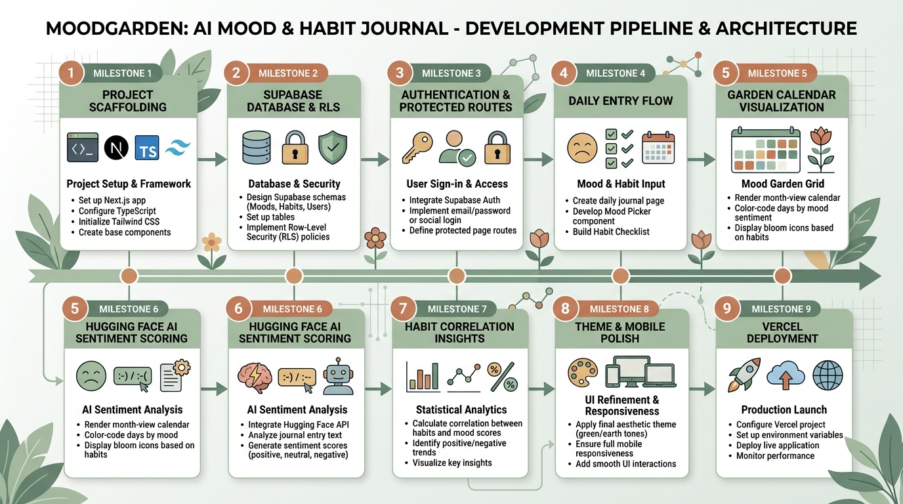

# MoodGarden — AI Mood & Habit Journal

<p align="center">
  
</p>

<p align="center">
  <a href="https://nextjs.org"></a>
  <a href="https://www.typescriptlang.org"></a>
  <a href="https://tailwindcss.com"></a>
  <a href="https://supabase.com"></a>
  <a href="https://huggingface.co"></a>
  <a href="LICENSE"></a>
</p>

> **"A journal that tells you *why* you feel the way you do, and shows it as a garden."**

MoodGarden is a daily journaling application designed to make emotional reflection rewarding and insightful. In under 60 seconds a day, users log their mood, track daily habits (sleep, exercise, hydration, socializing, nutrition), and write a short reflection. The app scores sentiment with AI, calculates statistically grounded habit correlations, and visualizes the month as a blooming calendar garden.

---

## Key Features

- **60-Second Daily Check-in**:
  - 5-point calm emoji scale (`🌧️ Very Low` to `🌸 Flourishing`).
  - Habit checklist: *Slept well, Exercised, Drank water, Socialized, Ate well*.
  - 500-character reflection textarea with live character counting and instant, non-blocking saving.
- **Living Garden Visualization**:
  - 7-column calendar month view.
  - Tiles color-graded along a warm-to-cool earth tone scale (muted clay to sage green).
  - Habit bloom indicators: Flower SVG petals visually open from a small bud (1 habit) to a full blossom (5 habits).
  - Smooth staggered tile entrance animations powered by Framer Motion.
  - Interactive Day Modal for reviewing past reflections, mood, and sentiment scores.
- **AI Sentiment Scoring**:
  - Powered by Hugging Face's `distilbert-base-uncased-finetuned-sst-2-english`.
  - Normalized to a single `-1.000` to `+1.000` emotional valence scale.
  - Asynchronous and non-blocking: Entry saving is instant; sentiment scores attach seamlessly in the background.
- **Statistical Habit Correlations**:
  - Compares average moods on days a habit was logged vs. days it was not.
  - Enforces `MIN_SAMPLE = 7` threshold on both sides to prevent spurious early insights.
  - Generates clear, human-readable natural language insight cards (e.g., *"You've scored 1.3 points higher on mood on days you exercised, over your last 18 entries."*).
- **Calm, Distraction-Free Design**:
  - Warm off-white light palette (`#FAF7F2`) and deep slate dark palette (`#1A1B1E`).
  - Distinctive typography using Google Fonts **Fraunces** (serif headings) and **Inter** (clean body text).
  - Built-in `ThemeToggle` respecting OS preferences and storing state.

---

## Tech Stack

| Layer | Technology | Description |
|---|---|---|
| **Framework** | [Next.js 14+](https://nextjs.org) (App Router, Turbopack) | SSR, React Server Components, and Route Handlers |
| **Language** | [TypeScript](https://www.typescriptlang.org) | Strict type checking throughout client and API layers |
| **Styling** | [Tailwind CSS v4](https://tailwindcss.com) | Utility-first CSS variables with dark mode support |
| **Animation** | [Framer Motion](https://www.framer.com/motion/) | Staggered tile blooms, scale transitions, and modals |
| **Icons** | [Lucide React](https://lucide.dev) | Clean, lightweight UI icons |
| **Auth & DB** | [Supabase](https://supabase.com) (PostgreSQL) | JWT authentication, row-level security (RLS), and relational queries |
| **AI Inference** | [Hugging Face](https://huggingface.co) API | DistilBERT sentiment classification model |
| **CI/CD** | GitHub Actions & [Vercel](https://vercel.com) | Automated testing, linting, and continuous deployment |

---

## Project Structure

```
moodgarden/
├── app/
│   ├── (auth)/
│   │   ├── login/page.tsx          # Login form with Suspense boundary
│   │   └── signup/page.tsx         # Signup form with Supabase auth
│   ├── api/
│   │   ├── entries/route.ts        # POST upsert entry, GET month entries
│   │   ├── entries/[date]/route.ts # GET specific day entry
│   │   ├── sentiment/route.ts      # Non-blocking AI sentiment scoring
│   │   └── insight/route.ts        # Statistical correlation route
│   ├── garden/page.tsx             # Calendar garden visualization
│   ├── today/page.tsx              # Daily journal check-in page
│   ├── layout.tsx                  # Root layout with Fraunces & Inter fonts
│   ├── globals.css                 # Custom design tokens & theme variables
│   └── page.tsx                    # Landing page
├── components/
│   ├── DayModal.tsx                # Detailed tile inspection dialog
│   ├── EntryForm.tsx               # Daily reflection form
│   ├── GardenGrid.tsx              # 7-column calendar grid
│   ├── GardenTile.tsx              # Staggered tile with blooming flower SVG
│   ├── HabitChecklist.tsx          # 5 core habit toggles
│   ├── InsightCard.tsx             # Sprout card displaying correlation insights
│   ├── MoodPicker.tsx              # 5-level calm emoji selector
│   ├── Navbar.tsx                  # Navigation header with auth status
│   └── ThemeToggle.tsx             # Sun/Moon light & dark mode toggle
├── lib/
│   ├── correlation.ts              # Pure statistical correlation algorithm
│   ├── moodColor.ts                # Mood-to-color mapping utilities
│   ├── sentiment.ts                # Isolated Hugging Face inference caller
│   ├── storageFallback.ts          # Local memory store for zero-config preview
│   ├── supabaseClient.ts           # Browser Supabase client
│   └── supabaseServer.ts           # SSR cookie-based Supabase server client
├── supabase/
│   └── schema.sql                  # PostgreSQL tables, RLS policies, & indexes
├── test/
│   └── logic.test.mjs              # Node native test runner unit test suite
├── middleware.ts                   # Route protection (/today, /garden)
└── package.json
```

---

## Quickstart & Local Setup

### 1. Prerequisites
- [Node.js](https://nodejs.org) v18+ or v20+ LTS
- [Git](https://git-scm.com)

### 2. Clone the Repository
```bash
git clone https://github.com/your-username/moodgarden.git
cd moodgarden/moodgarden
```

### 3. Install Dependencies
```bash
npm install
```

### 4. Configure Environment Variables
Create `.env.local` based on `.env.local.example`:
```bash
cp .env.local.example .env.local
```

Fill in your configuration:
```env
NEXT_PUBLIC_SUPABASE_URL=https://your-project.supabase.co
NEXT_PUBLIC_SUPABASE_ANON_KEY=your-anon-public-key
SUPABASE_SERVICE_ROLE_KEY=your-service-role-key
HUGGINGFACE_API_KEY=hf_your_api_token
```
*(Note: If left as placeholders, the app automatically runs in local fallback mode so all pages and interactions can be tested immediately.)*

### 5. Supabase Database Setup
1. Create a project at [supabase.com](https://supabase.com).
2. Open the **SQL Editor** in your Supabase dashboard.
3. Paste and run the complete script from `supabase/schema.sql`.
4. In **Authentication > Providers > Email**, ensure email provider is enabled.

### 6. Run the Development Server
```bash
npm run dev
```
Open [http://localhost:3000](http://localhost:3000) to view the application.

---

## Running Tests & Production Build

### Unit Tests
Run the unit test suite verifying correlation algorithms, sample thresholds, and color scales:
```bash
node --test test/logic.test.mjs
```

### Production Build
Verify TypeScript type-checking and bundle compilation:
```bash
npm run build
```

---

## Deploying to Vercel

1. Push this repository to GitHub.
2. In [Vercel](https://vercel.com), click **Add New > Project** and import your repository.
3. Set the **Root Directory** to `moodgarden` (if the repo root contains outer docs) or `./`.
4. Under **Environment Variables**, add:
   - `NEXT_PUBLIC_SUPABASE_URL`
   - `NEXT_PUBLIC_SUPABASE_ANON_KEY`
   - `SUPABASE_SERVICE_ROLE_KEY`
   - `HUGGINGFACE_API_KEY`
5. Click **Deploy**. Vercel will automatically build and deploy the app on every push to `main`.

---

## Specifications & Documentation

The complete engineering design specifications can be found in the repository root:
- [PRD.md](PRD.md) — Product requirements and non-goals
- [ARCHITECTURE.md](ARCHITECTURE.md) — Architectural patterns and data flow
- [DATABASE_SCHEMA.md](DATABASE_SCHEMA.md) — Database tables, relations, and RLS
- [API_SPEC.md](API_SPEC.md) — REST Route Handler specifications
- [AI_FEATURES.md](AI_FEATURES.md) — DistilBERT inference and correlation logic
- [DESIGN_SYSTEM.md](DESIGN_SYSTEM.md) — Color tokens, typography, and motion rules
- [TASKS.md](TASKS.md) — Milestone checklists and implementation progress

---

## License

This project is licensed under the [MIT License](LICENSE).
